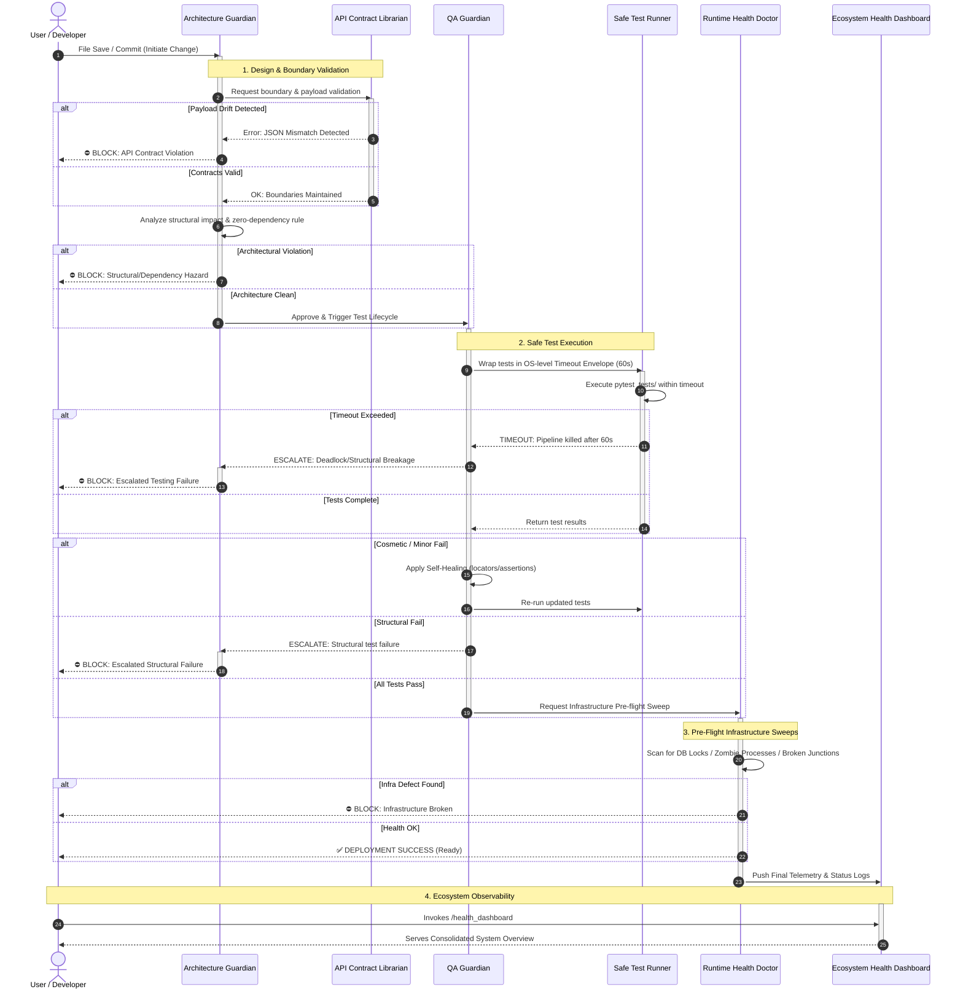
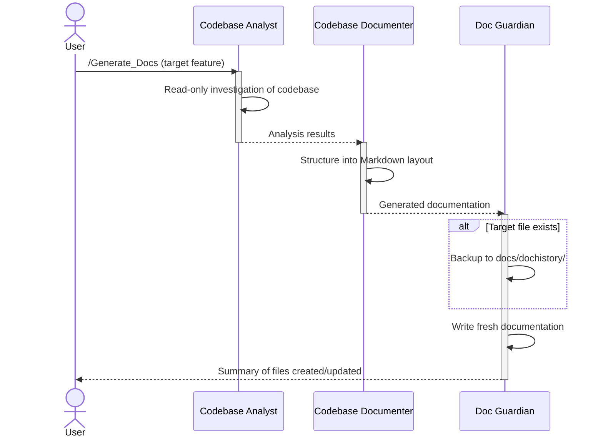

# 🛡️ AetherVault Guardian Workflow Execution (Sequence)

This sequence diagram details the real-time interaction between the guardians when a user introduces a code change. It highlights the primary "Happy Path" along with conditional escalations.

## Sequence Diagram

## Flow Explanation

1. **Initiation & Validation**: 
   The sequence begins when the developer saves a file. The **Architecture Guardian** catches the event and immediately queries the **API Contract Librarian**. If the librarian detects any drift between the frontend components and backend routers, it throws a JSON Mismatch error, allowing the Architecture Guardian to block the commit. If approved, the Architecture Guardian runs its own internal checks for AetherVault/zero-dependency violations.
   
2. **Safe Execution**: 
   Passing the structural checks, the baton is handed to the **QA Guardian**, which delegates actual test execution to the **Safe Test Runner**. The Safe Test Runner wraps all tests in a strict 60-second OS-level timeout envelope. If a test fails on a purely cosmetic issue (locator changes, UI text updates), the QA Guardian enters a self-healing inner loop. If a structural/architectural failure is detected, it escalates to the Architecture Guardian. If a timeout occurs, the pipeline is force-killed and escalated.

3. **Runtime Sweep**: 
   Assuming a perfect test pass, the **Runtime Health Doctor** executes a live sweep of the OS infrastructure. It looks for silent killers like locked SQLite databases, broken NTFS junctions, or orphaned engine processes that tests wouldn't natively catch.

4. **Telemetry Sync**: 
   Upon completion (whether successful or blocked), the current infrastructure footprint logs are funneled into the **Ecosystem Health Dashboard**, which the User pulls on-demand with `/health_dashboard`.

## Documentation Pipeline (Parallel Track)

For documentation changes, a separate pipeline is available via `/Generate_Docs`:

