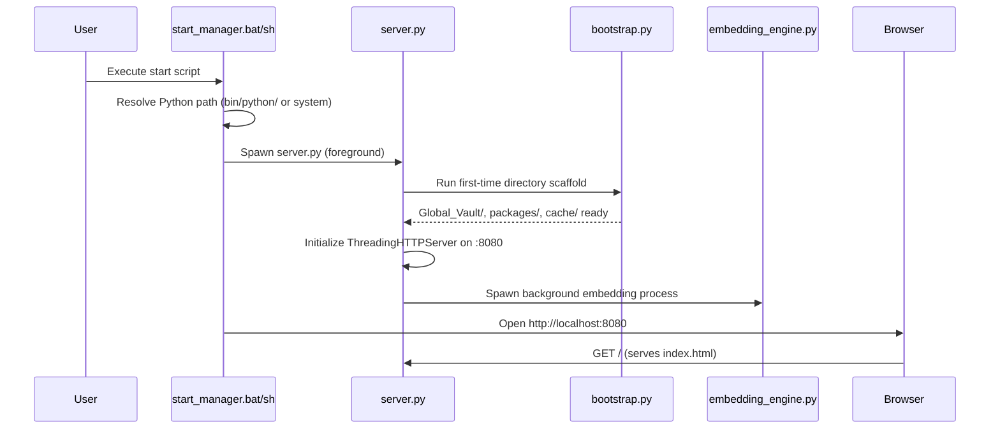

# AetherVault: Deployment and Setup

## Overview
This document outlines the zero-friction installation and deployment process for the AetherVault. Designed around the *AetherVault* principle of zero-dependency bloat, the manager self-bootstraps using a portable, standalone Python installation. It requires no administrator privileges, no Node.js installations, and no system-wide Python modifications.

## Prerequisites
- **Operating System:** Windows 10/11, macOS (Intel/Silicon), or Linux (x86_64, aarch64)
- **Disk Space:** ~200MB for the manager core + additional space for downloaded generative models.
- **Git** (Optional, but recommended for OTA updates and App Store repository cloning).
- **Network Connection:** Required for the first run to download the portable Python binary and `sentence-transformers` dependencies.

## Installation Process

The installation scripts automatically download `python-build-standalone`, extract it locally to the `bin/` directory, create necessary system folders, and install minimal semantic search dependencies within an isolated space. 

### Windows Setup
Open a command prompt or double-click the included batch script from the project root:
```batch
install.bat
```
This script handles the `curl` download of the Windows MSVC x86_64 Python binary, extracts it natively using `tar`, installs Torch (CPU only), `sentence-transformers`, and automatically triggers `.backend/bootstrap.py` for finalizing setups.

### macOS & Linux (UNIX) Setup
Open your terminal and run the shell script:
```bash
chmod +x install.sh
./install.sh
```
The script dynamically detects your OS (Darwin vs. Linux) and Architecture (`arm64`/`aarch64` vs. `x86_64`) via `uname -m`, requesting the precise `python-build-standalone` tarball matching your hardware.

## Launching the Manager

Once installed, use the start scripts to initialize the web dashboard and its background services. 

### Windows
```batch
start_manager.bat
```

### macOS & Linux
```bash
./start_manager.sh
```

**Boot Sequence Details:**
1. **Python Path Resolution:** Checks if the local portable Python exists in `bin/python/`. If not, it gracefully degrades to using the system `python/python3` installation.
2. **Background Scanner:** Spawns `.backend/embedding_engine.py` as an asynchronous background task (`start /B` or `nohup`) to handle high-speed semantic searches for models.
3. **Web UI Launch:** Opens `http://localhost:8080` in your default browser natively.
4. **Server Initialization:** Binds the zero-dependency `http.server.ThreadingHTTPServer` component found in `.backend/server.py` to the foreground shell to print live access logs.

### Boot Sequence Diagram



> [!WARNING]
> Keep the terminal window open while using the application. Closing it will terminate the backend HTTP server and halt any generation proxies in the UI.

## System Tray Launcher

For production deployments (especially the PyInstaller-bundled `.exe` distribution), the **Tray Launcher** (`tray_launcher.py`) replaces the terminal-based start scripts with a polished system tray experience.

### Features
- **Singleton Mutex (Windows)**: Uses a Windows named mutex (`AetherVaultLauncherMutex_Prod_v1`) via `ctypes.windll.kernel32.CreateMutexW` to ensure only one instance runs at a time. If a second instance is launched, it simply opens the dashboard in the browser and exits.
- **Auto-Bootstrap GUI**: If the portable Python runtime is not found in `bin/python/`, the launcher displays a themed Tkinter progress window that downloads `python-build-standalone`, extracts it, and installs base dependencies (pip, PyTorch CPU, sentence-transformers) with real-time progress bars.
- **Silent Server Spawn**: The backend `server.py` is launched as a windowless subprocess (`CREATE_NO_WINDOW` flag on Windows) with output redirected to `logs/server.log`.
- **Browser Auto-Open**: A background thread polls `http://localhost:8080` every second (up to 30s timeout) and opens the browser automatically once the server responds with HTTP 200.
- **System Tray Menu**: Provides a two-item tray menu — "Open AetherVault Dashboard" (default double-click action) and "Quit Application."

### Graceful Shutdown Sequence
When the user clicks "Quit Application" from the tray:
1. Sends `POST /api/shutdown` to the server for graceful HTTP server teardown.
2. Waits up to 22 seconds for the server to exit cleanly (including its own embedding engine cleanup).
3. If the server process is still alive, performs a `taskkill /T /F` (Windows) or `SIGKILL` (UNIX) fallback.
4. **Safety Sweep 1**: Kills any orphaned `embedding_engine.py` processes via WMIC/pkill pattern matching.
5. **Safety Sweep 2**: Broad sweep kills any `python.exe` processes whose command line contains the application folder name.
6. **Final Kill**: Force-kills the server process if it survived all prior attempts.

### Logging
All launcher events are written to `launcher.log` in the project root with ISO timestamps. The server subprocess writes to `logs/server.log`.

## Directory Initialization Defaults

During the first run of `install`, the system ensures three critical infrastructure directories exist safely at the root:
- `bin/` - Houses the standalone Python runtime, preventing PyTorch conflicts with other tools.
- `Global_Vault/` - The master storage folder where you place all your models (Safetensors, LoRAs).
- `packages/` - Sandboxed destination for underlying inference engines downloaded via the App Store.

