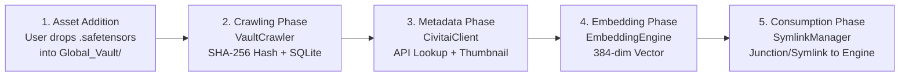

# Global Vault System

## Overview
The Global Vault System is a cross-platform asset orchestration layer that eliminates multi-gigabyte model file duplication. Instead of redownloading heavy models (like checkpoints or Loras) for every installed AI engine, the system maintains a canonical `Global_Vault/` directory. It uses zero-byte directory links (NTFS Directory Junctions on Windows, Symbolic Links on UNIX) to link the canonical assets into isolated application directories. Background pipelines automatically crawl the vault, hash the files, fetch API metadata (CivitAI/HuggingFace), and generate semantic embeddings for intelligent search.

## Key Features / User Flows
- **"Drop Once, Use Everywhere"**: Users place an asset (e.g., Safetensors, Checkpoints) into a `Global_Vault` subfolder. The asset instantly becomes available across all installed engines like ComfyUI, Forge, or Automatic1111 without duplicating bytes on disk.
- **Auto-Discovery & Enrichment**: Upon dropping a file, a background crawler detects it, computes a SHA-256 hash in chunks, and asynchronously fetches thumbnails, metadata, and versioning info from CivitAI.
- **Smart Symlinking Operations**: Apps automatically receive the models via symlinks on installation. A periodic health-checker repairs any broken or severed links to ensure high availability.
- **Semantic Search**: Text embeddings are built from model metadata, allowing for fuzzy and conceptual searching of the user's local model catalog.

## Architecture & Modules
- **Symlink Manager**: Handles cross-platform, non-destructive link generation. It resolves volume boundaries and cleanly overwrites broken symlinks while refusing to overwrite real files.
- **Vault Crawler**: Traverses `Global_Vault` to identify `.safetensors`, `.pt`, `.ckpt`, and `.bin` files that are not yet tracked in the `metadata.sqlite` DB. Hashing logic chunks massive files to prevent RAM exhaustion.
- **CivitaiClient & HFClient**: Query external registries using the hashed signature of the vault file. Converts API payloads into local `metadata_json` caches and downloads preview thumbnails.
- **EmbeddingEngine**: A background process utilizing `sentence-transformers` to generate a 384-dimensional vector representation of the model for fast offline search.
- **UpdateChecker**: Compares the installed model version ID against the latest CivitAI versions to notify the user of updates.

## Data & Logic Flow
1. **Asset Addition**: A user drops `model.safetensors` into `Global_Vault/checkpoints/`.
2. **Crawling Phase**: `VaultCrawler` running via `ThreadPoolExecutor` discovers the file, chunks exactly 4MB blocks, calculates a SHA-256 hash, and inserts the record into SQLite `models`.
3. **Metadata Phase**: `CivitaiClient` polls the new hashes, requests `GET /api/v1/model-versions/by-hash/{hash}`, and populates `metadata_json` alongside downloading the thumbnail to `.backend/cache/thumbnails/{hash}.jpg`.
4. **Embedding Phase**: `EmbeddingEngine` daemon converts metadata to vector representations via `sentence-transformers`.
5. **Consumption Phase**: App Store Installer invokes `SymlinkManager` (`mklink /J` or `os.symlink`) connecting `packages/<engine>/models/checkpoints` directly to `Global_Vault/checkpoints`.

### Data Flow Pipeline

## Configuration Options
- **Ignored Directories**: Subfolders inside `Global_Vault` can contain `.manager_ignore` files to bypass the `VaultCrawler` indexing entirely.

## Business Rules & Edge Cases
- **Idempotency**: The symlinking process will cleanly succeed if a link already points to the correct vault directory, and will safely unlink/recreate if it points to an archaic path.
- **Drive Letter Constraints (Windows)**: Directory Junctions cannot easily span across disk volumes. In scenarios where `Global_Vault` and `packages/` are on different NTFS volumes, the application relies on engine-specific YAML routing as a fallback.
- **Database Safety**: Under no circumstance does the metadata scraper write and hash the same record simultaneously to prevent SQLite lockups.
- **API Rate Limiting**: The system strictly limits CivitAI polling (1 req/sec limit) and batches HuggingFace calls to ensure robust background processing without ban risks.

## Related Files & Functions
- `.backend/vault_crawler.py` -> `VaultCrawler.crawl()`
- `.backend/symlink_manager.py` -> `create_safe_directory_link(source_dir, target_link)`
- `.backend/metadata_db.py` -> `MetadataDB.insert_or_update_model()`
- `.backend/civitai_client.py` -> API payload translator and image downloader.
- `.backend/embedding_engine.py` -> Local AI vector search system.

## Observations / Notes
- The crawler operates safely on Multi-Channel NVMe SSDs utilizing a basic ThreadPool `max_workers=4` structure, keeping UI stutters minimal.
- The use of junctions on Windows rather than hardlinks keeps operations out of administrative scope, maintaining zero-friction portability for end users.
