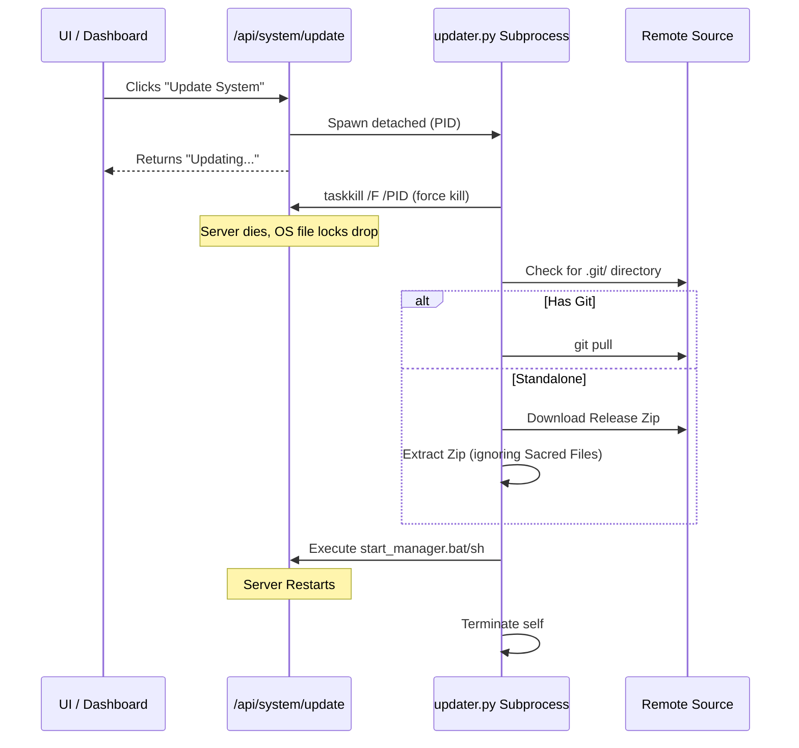

# Self-Healing Architecture (OTA Ghost Upgrades)

## Overview
Generative AI Manager incorporates a robust, Self-Healing Code Architecture designed to solve a significant pain point in application maintenance: applying codebase updates without corrupting user data or requiring manual user re-installation. The **OTA (Over-The-Air) Ghost Updater** automates this entirely. It "ghosts" the running server by terminating it, applying hot-patches via `git pull` or zip extraction, and automatically restarting the dashboard—all triggered from a single UI button.

## Key Features
- **Zero Data Loss**: Sacred data boundaries explicitly isolate the application engine logic from the persistent state (`Global_Vault`, `packages`, `metadata.sqlite`, `settings.json`).
- **One-Click Upgrades**: End-to-end automation spanning from process termination to file patching and system restart.
- **Environment-Agnostic Patching**: Supports applying git pulls (for cloned repositories) or zip extractions (for standalone releases), branching smoothly between deployment types.
- **Cross-Platform Auto-Relaunch**: Handles detached subprocess spawning consistently across Windows (`CREATE_NEW_PROCESS_GROUP`) and UNIX environments.
- **Resilient Fallbacks**: If git isn't available or fails, it natively falls back to standalone zip patching.

## Architecture

The system follows a strict, single-pass pipeline orchestrated by a detached daemon (`.backend/updater.py`), completely disjointed from the parent API server in order to avoid OS-level file lock contention during the update.

### Flow Diagram



### 1. Detached Daemon Spawning
When the update is triggered via the API, `server.py` invokes `updater.py` as a detached subprocess and immediately returns a success status to the UI frontend. It passes the current server process ID (PID) as an argument (`--pid <server_process_id>`). 

### 2. File Lock Drop
`updater.py` runs `force_kill_pid()`, using OS-specific termination (`taskkill` on Windows or `SIGTERM` on UNIX) to kill the original parent server. It then sleeps for a short period (`2` seconds) to guarantee the host OS has fully released all file locks associated with the running backend.

### 3. Source Synchronization
If a `.git/` directory is present, the script simply runs `git pull`—a rapid update for developers. If not, the application uses a standalone zip extraction, pulling from the designated release endpoint and extracting the files temporarily.

### 4. Sacred Boundaries Constraint
During zip extraction, the updater employs a strict **Ignore List** to ensure persistent user data is preserved untouched:
```python
ignore_dirs = {"Global_Vault", "packages", "cache", "metadata.sqlite", "settings.json"}
```
A complementary safeguard exists inside `build.py` to ensure release zips never overwrite these core paths.

### 5. Seamless Reload
Following a successful update operation, the updater uses `subprocess.Popen` to call `start_manager.bat` (Windows) or `start_manager.sh` (UNIX). The updater then exits cleanly.


## Relevant Files
- `.backend/updater.py`: Core logic for the update daemon, handling killing, patching, and restarting.
- `.backend/server.py`: Enacts the application route `/api/system/update` to fork the daemon.
- `build.py`: Manages exclusion logics and constructs release zip directories safely so as to not trample user directories.
- `start_manager.bat / .sh`: Subprocess initialization hooks called by the updater for bootstrapping.
