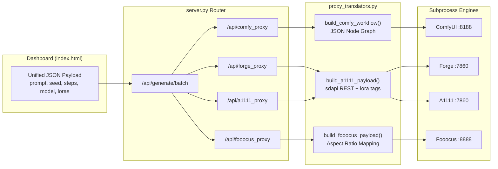

# Zero-Friction Inference

## Overview
**Zero-Friction Inference** is the core capability that allows the AetherVault to transparently route generations to multiple backend engines (e.g., ComfyUI, SD WebUI Forge, Automatic1111, Fooocus) from a single, beautifully styled UI dashboard. By abstracting the intricacies of specific backend APIs through Intelligent Payload Translators, users enjoy a seamless experience without modifying their workflow, even under advanced scenarios like FLUX pipelines, multi-LoRA stacking, and High-Res fixes.

## Key Features / User Flows
- **Universal Payload Dashboard:** A single UI form handles parameters (prompts, seeds, dimensions, samplers, refiners) without requiring backend-specific inputs.
- **Intelligent Translation:** Parameters are natively translated. For example, a unified format is translated into an explicit JSON node-graph for ComfyUI, into `<lora:...>` payload strings for Automatic1111/Forge, or mapped to precise aspect ratio definitions for Fooocus.
- **Advanced Architecture Support:** Out-of-the-box support for SD1.5, SDXL, and FLUX image pipelines.
- **Batch Processing:** Enforces sequential processing via an in-memory queue (`_batch_queue`) to prevent overwhelming localized hardware resources.
- **Direct Image Interfacing:** Fully supports drag-and-drop Image-to-Image (Img2Img) pipelines utilizing Base64 transmission and automatic ControlNet/Denoising scaling.

## Architecture & Modules
Zero-Friction Inference is architecturally isolated in the **Universal Inference Router** layer.
- **Frontend Context (`index.html`):** The dashboard constructs a single engine-agnostic JSON payload containing generation configurations.
- **Routing Endpoints (`/api/<engine>_proxy`):** Specific backend dispatchers configured across predefined isolated localhost ports (e.g., ComfyUI at `8188`, A1111/Forge at `7860`, Fooocus at `8888`).
- **Translation Engine (`proxy_translators.py`):** Modulates the data, converting unified properties into exact configurations tailored for each engine.
- **Batch Queue Coordinator (`server.py`):** Intercepts requests sent to `/api/generate/batch` globally across any backend, utilizing a background `_batch_worker` to sequence generation workloads dynamically.

## Data & Logic Flow
1. **Initiation:** User clicks "Generate" on the frontend. The `index.html` file composes a uniform payload and routes it to `POST /api/generate/batch` or directly to an engine proxy.
2. **Translation:** The request is delegated to `proxy_translators.py` methods (`build_comfy_workflow()`, `build_a1111_payload()`, `build_fooocus_payload()`). 
3. **Graph Construction (ComfyUI Specific):** Dynamic graphs are constructed. The engine decides on-the-fly whether to spawn `FLUX` specific nodes (`DualCLIPLoader`, `FluxGuidance`) or `SDXL/SD1.5` nodes (`KSampler`, `CheckpointLoaderSimple`). LoRA lists, ControlNets, and High-Res fixes recursively extend the node graph chain.
4. **Execution:** `urllib.request` proxies the rewritten JSON structure to the target subprocess, waiting synchronously.
5. **Response:** Results (Base64 images, seed metadata) are pulled off the response stream and relayed back to the UI.

### Engine Routing Diagram

## Configuration Options
The inference stack responds directly to the `settings.json` configurations dictating the active pipeline endpoints. There are no exposed environment variable restrictions; it strictly uses Python `urllib` to enforce the AetherVault 0-dependency mandate.

## Business Rules & Edge Cases
- **Absolute Checkpoint Integrity:** FLUX pipelines fundamentally require explicit separation of `UNETLoader` and `DualCLIPLoader`. The translator enforces these topology boundaries strictly.
- **Automatic Fallbacks:** Missing VAEs in a ComfyUI request fallback cleanly to `ae.safetensors` via Global Vault introspection instead of halting node construction. Similarly, Fooocus aspect ratios are computed automatically to visually closest standard pairs (`get_closest_fooocus_aspect`).
- **Graceful Timeouts:** In the event the detached subprocess crashes midway, the proxy layer enforces connection timeouts (default 10s) to prevent indefinite UI hangs.
- **High-Res Upscalers:** Transparent parameter routing automatically differentiates between Pixel and Latent upscaling configurations depending on the provided refiner logic.

## Related Files & Functions
- **Proxy Endpoints:** `.backend/server.py` (`handle_comfy_proxy`, `handle_forge_proxy`, `handle_a1111_proxy`, `handle_fooocus_proxy`, `handle_batch_generate`)
- **Graph Translators:** `.backend/proxy_translators.py` (`build_comfy_workflow`, `build_a1111_payload`, `build_fooocus_payload`, `get_hires_upscaler_params`)
- **Definition Document:** `.agents/skills/universal_inference_router/SKILL.md`

## Observations / Notes
- The proxy translator heavily abstracts ComfyUI graph complexity. Modifying the payload in `proxy_translators.py` requires meticulous attention to the "In-Node" / "Out-Node" reference counts (e.g., passing node `["14", 0]` into the latent variable of node `["18"]`).
- Maintained completely using the Python Standard Library (`http.server` & `urllib`), ensuring cross-platform, zero-dependency behavior inline with the project's Directive Layer constraints.
